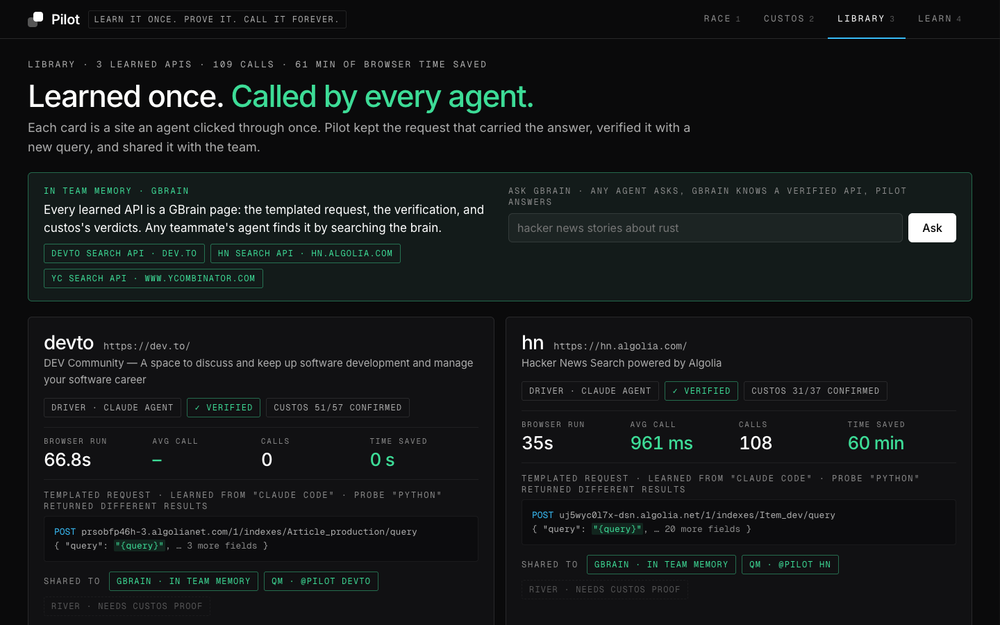
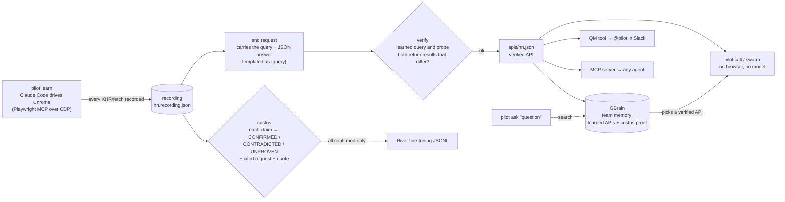

# Pilot

**Learn it once. Prove it. Call it forever.**

Your agents learn a website once, custos checks their work against a recording of what they actually did, and every agent on your team then calls that site through a verified API instead of clicking through it.

**GBrain is the core.** It holds your team's shared memory of every site an agent has learned and what custos proved about each one. Ask `pilot ask "<question>"` and Pilot searches GBrain for a verified learned API, then answers without opening a browser or running a model to click through the site (latency: TODO(measure)). Pilot automates one tedious job: agents clicking through the same websites over and over. A QM `@pilot` tool lets any teammate's agent use an API that someone else learned.

Built from scratch during hackathon hours at the YC "Own Your Intelligence" hackathon (SF, 2026-09-27), using Superset: several agents worked in parallel in Superset workspaces. The git history starts at 1:16 pm. What an agent learns usually disappears when its session ends. With Pilot it becomes something your team owns, and only work custos has proven goes into memory (GBrain) or training data (River).

## Screens

| Race: agent vs. API | custos verdicts | Library |
|---|---|---|
|  |  |  |

<!-- TODO(screens): the frontend agent adds these PNGs to docs/screens/. Demo video: TODO(video URL). -->

## The problem

Browser agents are slow, they repeat the same work, and you can't check what they tell you.

| Problem | Measured (from files in `apis/`) |
|---|---|
| **Slow** | A real Claude Code agent took **35.0 s** and **11 requests** (5 browser tool calls) to search hn.algolia.com once. A scripted browser took 24.3 s and 16 requests. |
| **Repeated** | The site already returns the answer in **one** JSON request. Replaying that request took **947 ms**, about **37× faster** than the agent run. The agent still clicks through the whole flow again in every session. |
| **Unverifiable** | The agent's summary made **34** separate claims. custos confirmed **32**, contradicted **0** and left **2** UNPROVEN, checking against the 11 recorded requests in about 90 s. Each confirmed claim cites a request. If you accept a summary on trust, one wrong claim can end up in memory or in training data. |
| **At scale** | 50 searches at once through `pilot swarm`: TODO(measure) wall time, compared with roughly 50 × 35 s ≈ 29 min if the agent ran them one after another. |

Sources: `apis/hn.recording.json` (duration, requests, agent steps), `apis/hn.calls.log` (call latency), `apis/hn.json` `.verified`, `apis/hn.custos.json` (verdicts).

## How it works



1. **Learn.** Pilot opens Chrome with a debugging port and records every XHR, fetch and document response. A headless Claude Code agent drives the same browser through Playwright MCP (`--cdp-endpoint`) and searches the site the way a person would. The *end request* is the one whose URL or body contains the typed query and whose response is JSON. Pilot saves it with the query replaced by `{query}`. None of this is specific to one site.
2. **Verify.** Pilot replays the saved request twice, once with the learned query and once with a probe query such as "python". Both must return results, and the two result sets must differ. If they are identical, the query is hardcoded in the saved request and verification fails.
3. **custos.** Pilot splits the agent's summary into self-contained claims. An LLM judge gives each claim a verdict against a numbered index of the recording and must cite `[request] "quote"`. The **grounding guard** downgrades any verdict whose quote does not appear in the cited request to UNPROVEN. Pass `--rules` for a fallback that runs offline, with no model.
4. **Call / swarm.** Pilot fills in the template and sends the request. No browser and no model are involved. `swarm` runs many queries in parallel.
5. **Remember (GBrain).** Every learned API becomes a GBrain page that records the site, the call, whether verification passed and what custos found. `pilot ask "<question>"` searches GBrain for a matching verified API and calls it, so an agent never has to remember which site to use.
6. **Share.** Learned APIs are plain files in `apis/`. Pilot turns them into a QM tool and an MCP server as well. Only runs that custos fully confirmed go into the River training export.

## Quick start

Requirements: Node ≥ 24 (it runs the `.ts` files directly), Google Chrome at the default macOS path, and Claude Code at `~/.local/bin/claude` for the agent driver and the LLM judge.

```sh
npm install
bin/pilot learn hn https://hn.algolia.com/ "claude code"   # Claude Code learns the site (--typer = scripted browser, no model)
bin/pilot call hn "rust async"                             # replay the request, ~1 s
bin/pilot swarm hn "rust" "gbrain" "yc" "robotics"         # many queries at once (or a .txt file, one per line)
bin/pilot custos hn --summary                              # judge the agent's own summary against the recording
bin/pilot custos hn "It has 2845 points"                   # or judge specific claims (--rules = offline)
bin/pilot verify hn                                        # learned query + probe must return different results
bin/pilot list                                             # learned APIs, proof status, calls, time saved
bin/pilot console                                          # live console on http://localhost:4321
bin/pilot pages                                            # GBrain pages → gbrain import apis/ --no-embed
bin/pilot ask "top hacker news stories about claude code"  # GBrain picks the verified API and answers
bin/pilot qm                                               # QM tool → qm/sandbox/tools/pilot/
bin/pilot river                                            # verified-only fine-tuning JSONL
bin/pilot mcp                                              # MCP server so any agent can call learned APIs
```

`apis/hn.*` is already committed, so `call`, `swarm`, `custos` and `list` work immediately without running `learn` first.

## Sponsor integrations

| Sponsor | What Pilot does | Status |
|---|---|---|
| **GBrain (core)** | GBrain is the team's shared memory of learned sites. `pilot pages` writes `apis/<name>.md` with `title`/`type`/`tags` frontmatter, the call signature, verification, the custos status and an example response. `gbrain import apis/ --no-embed` indexes them. `pilot ask "<question>"` (and the MCP tool `pilot_ask`) searches GBrain, picks a verified API and calls it. **Challenge fit:** it automates the tedious task of agents re-clicking the same websites. | Page writer done. `pilot ask` in progress (`src/gbrain.ts`). TODO(measure): ask latency and `gbrain search` hit |
| **QM** | Extends QM with an `@pilot` tool: any teammate's QM agent can use APIs that someone else learned. `pilot qm` writes a deployment-layer `tool.json` along with a self-contained `call.mjs` and the learned `<name>.json` files. After `qm up`, `@pilot <site> <question>` in Slack calls the API a teammate learned. | Tool export done. **Needs a running QM deployment** before it works in Slack |
| **River** | `pilot river` exports `{"messages": [...]}` JSONL, keeping **only** runs where custos confirmed every claim from the agent's summary and naming each run it leaves out. | Export done. **No training results are claimed** unless a River job actually ran: TODO |
| **MCP (any agent)** | `pilot mcp` exposes learned APIs as MCP tools, including `pilot_ask`, so Claude Code, Cursor or any MCP client can call a site that someone else learned. | In progress |
| **Superset** | We built Pilot in Superset, with parallel agents in separate workspaces handling the core, the console, integrations and docs. | TODO: link to the Superset page |

## Design lineage

Pilot reuses designs that other projects already ship. Each row names the file the design came from.

| Pilot part | Source |
|---|---|
| Finding the end request; the typed input becomes the variable | Integuru, `integuru/graph_builder.py` (AGPL, so the approach is reimplemented, not copied) |
| `{query}` templating of the saved request | mitmproxy2swagger |
| Call and time-saved bookkeeping (`pilot list`) | Stagehand, `cacheService.ts` `withCache` |
| custos claim splitting (no pronouns, self-contained statements) | RAGAS, `src/ragas/metrics/_faithfulness.py`; DeepEval, `deepeval/metrics/faithfulness/templates/generate_claims.txt` |
| custos verdicts (yes/no/idk → CONFIRMED/CONTRADICTED/UNPROVEN, one per claim) | DeepEval, `deepeval/metrics/faithfulness/templates/generate_verdicts.txt` |
| Agent and recorder share one Chrome | microsoft/playwright-mcp `--cdp-endpoint`, which reuses the browser's default context (playwright-core `src/tools/mcp/program.ts`, `contexts()[0]`) |
| GBrain page format | garrytan/gbrain, `src/core/markdown.ts` (frontmatter: `title`, `type`, `tags`) |
| QM tool descriptor | yc-software/qm, `src/deployment/deployment-layer.ts` (ToolDescriptor) |
| Verify probe; error taxonomy | Cqctxs/Pilot, `src/compiler/validate.ts` and `src/shared/errors.ts`. Ideas only, reimplemented because that repo has no licence |
| Console race view | AdvaiytSane/environment-mem console (design only) |
| CLI help grouping | Cqctxs/Pilot, `src/cli/main.ts` |

The grounding guard, which drops a verdict to UNPROVEN when its quote is not in the cited request, is Pilot's own addition. We did not find an existing implementation to base it on.

## What is real and what is not

- **The agent is real.** The committed `hn` recording comes from a real headless Claude Code (Sonnet) run that drove Chrome through Playwright MCP. `apis/hn.recording.json` contains all 11 requests, the agent's 5 tool calls with timestamps, and its summary word for word. Nothing in it is simulated.
- **The measured numbers above come from files in this repo.** Run time and request count come from the recording, call latency from `hn.calls.log`, verification from `hn.json`, and verdicts from `hn.custos.json`. Anything we have not measured on this build is marked `TODO(measure)`. The ~37× figure is 35.0 s ÷ 0.947 s from a single call, not an average.
- **custos is not always right.** Its 2 UNPROVEN verdicts on the real summary are cases where the evidence was missing: the search term travels in the request body, which the judge's evidence index leaves out, and there is no time-filter parameter. They are not errors the agent made. With `--rules` offline, a false number can come back UNPROVEN instead of CONTRADICTED if those digits happen to appear anywhere in a response.
- **Limits.** Pilot only learns sites that fetch results with a background JSON request. Pages rendered on the server fail with `NO_ANSWER_REQUEST`. It has no login support (cookies are dropped when a request is saved), it handles one query variable and no pagination, and it is read-only: it only replays search requests. Saved headers can go stale, and then you re-run `learn`.
- **Terms of service.** Pilot replays a site's own search request. Use it only on sites that allow that. YouTube's terms forbid automated access, so we don't pitch it on YouTube.
- **QM** needs a running deployment (`qm up`) before `@pilot` answers in Slack. The exported tool alone does not do that.
- **River.** We only claim training results if a job actually ran. Otherwise what exists is the verified-only dataset export.
- **Built today.** All of the code in this repo was written during hackathon hours. The git history starts at 1:16 pm, and the core was rebuilt from scratch at about 2:10 pm. A throwaway Python spike from the morning explored the idea, but none of its code is in this repo, and its numbers are not repeated here.

## Team

Patrick Liu (UCSB).
