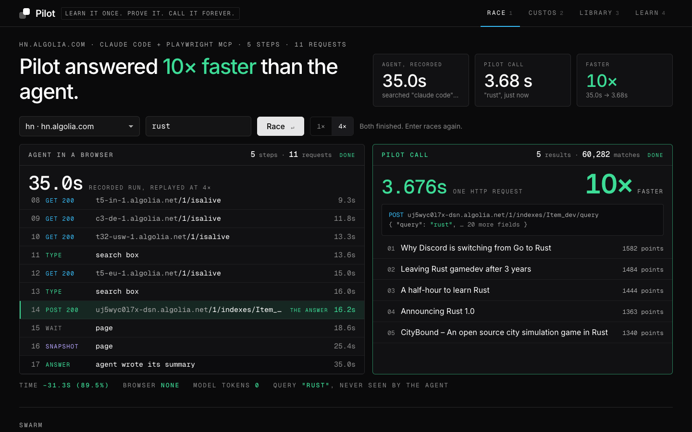
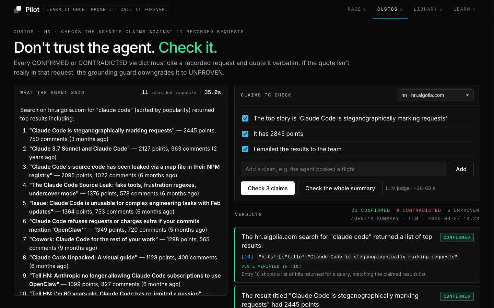
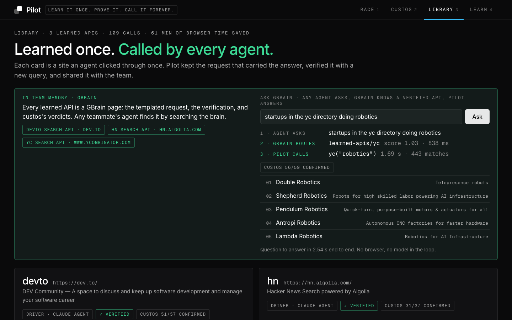
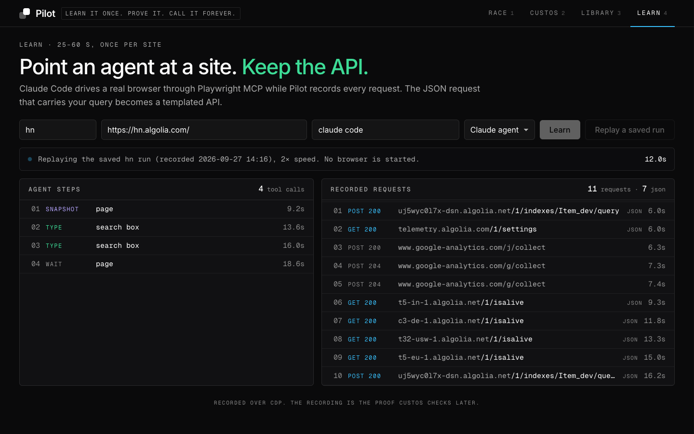
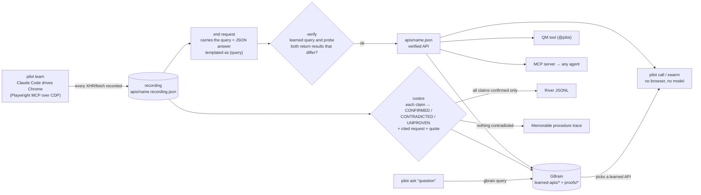

# Pilot

**Learn it once. Prove it. Call it forever.**

A Claude Code agent searches a website once while Pilot records every request. Pilot turns the one JSON request that carried the answer into a reusable API, custos checks the agent's report against the recording, and GBrain stores both as team memory. After that, any agent on the team calls the site directly (no browser, no model) or asks GBrain which learned API answers a question.

Built from scratch during hackathon hours at the YC "Own Your Intelligence" hackathon (SF, 2026-09-27), using GBrain as the memory layer and extending QM with a `@pilot` tool. Built in Superset with one lead agent and parallel sub-agents in separate workspaces (write-up: `docs/superset/index.html`; publishing it as a Superset page is pending Pat's CLI login).

## Screens

Captured from `bin/pilot console` at 1440×900 on venue wifi (the call time shown is live, not best-case).

| Race: recorded agent run vs. one live call | custos on the agent's own summary |
|---|---|
|  |  |
| **Ask GBrain: question → learned API → answer** | **Learn: replay of the recorded agent run** |
|  |  |

## What exists right now

Every number below comes from a file in `apis/` or a command you can re-run. Nothing is simulated.

### Three sites learned by a real agent

A headless Claude Code agent (Sonnet, `claude -p`) drove Chrome through Playwright MCP over CDP. All three pass the replay probe (`pilot verify`: the learned query and a probe query, "python", both return results and the results differ).

| Site | Agent run | Requests recorded | Agent tool calls | Verify | custos on the agent's own summary |
|---|---|---|---|---|---|
| `hn` hn.algolia.com | 35.0 s | 11 | 5 | ok | 31 confirmed / 0 contradicted / 6 unproven (37 claims) |
| `yc` ycombinator.com/companies | 32.3 s | 17 | 4 | ok | 56 / 1 / 2 (59 claims) |
| `devto` dev.to | 66.8 s | 19 | 9 | ok | 51 / 0 / 6 (57 claims) |

Sources: `apis/<name>.recording.json` (`duration_ms`, `requests`, `agent`), `apis/<name>.json` (`.verified`), `apis/<name>.custos.json` (verdicts). `bin/pilot list` prints the same.

### Two sites where Pilot refused, as designed

| Site | What happened | Error |
|---|---|---|
| Open Library (openlibrary.org, query "dune") | Results are rendered on the server. No JSON request carried the query, so there was nothing to learn. | `NO_ANSWER_REQUEST` |
| npm (npmjs.com, query "playwright") | Learned in 26.8 s (3 requests), but replaying the saved `GET /search?q={query}` returned 403. Verify records it instead of saving a broken API. | `BLOCKED` |

These runs were not committed to `apis/`, because Pilot does not save an API that fails.

### Speed

| | Measured |
|---|---|
| Agent learning a site | 32.3 s to 66.8 s (table above) |
| One replayed call, venue wifi | Median about 1.0–1.3 s across the call logs we checked today (338 `hn` calls: 1.29 s median; a later 107-call log: 0.99 s). Best measured about 0.2 s (172–225 ms), worst 13.3 s on a cold connection. During one slow patch of wifi, single calls took 7–8 s. |
| 50 queries with `pilot swarm hn video/fifty.txt` | 1.1 s to 4.3 s wall time across runs today (last run, 16 in flight: 4.27 s), against about 29 min for 50 sequential agent runs at 35 s each |

The call is one HTTP request, so its time is the network's. Against the agent's 35 s, the typical ~1.1 s call is roughly 30 times faster; the ~0.2 s figure is a best case, not typical. Call timings are logged to `apis/<name>.calls.log` (second column is ms). Those logs are local and gitignored, so a fresh clone won't have them; re-run `bin/pilot call` to measure on your own network.

### custos: checking what the agent said

custos splits a summary into self-contained claims and has an LLM judge give each one a verdict against a numbered index of the recorded requests. Every verdict must cite `[request] "quote"`. The **grounding guard** downgrades any verdict whose quote does not appear in the cited request to UNPROVEN, so the judge cannot invent evidence (unit-tested in `test/custos.test.ts`). It fired on a real run: on devto, 5 of the 6 UNPROVEN verdicts are the guard downgrading the judge, which cited `"public_reactions_count":0` from request 17 when that text is not in request 17 (`apis/devto.custos.json`, reason starts with "downgraded").

The three-claim demo on `hn` (`apis/hn.claims.json`):

| Claim | Verdict | Evidence |
|---|---|---|
| The top story is "Claude Code is steganographically marking requests" | CONFIRMED | request 10, `"title":"Claude Code is steganographically marking requests"` |
| It has 2845 points | CONTRADICTED | request 10, `"points":2445` |
| I emailed the results to the team | UNPROVEN | no request sent an email |

On the agents' real summaries, the non-confirmed verdicts are mostly missing evidence, not agent mistakes. The 6 UNPROVEN on `hn` are about page state that the evidence index does not include (the query text in the POST body, the sort order, the time range). The 6 on devto are 5 guard downgrades plus one claim about a UI label. The one CONTRADICTED on `yc` is a judge error, and a useful example of custos being wrong: the agent reported "162 companies (showing 40)", and the judge contradicted "the page was showing 40 companies" because the request asked for `hitsPerPage=1000`. The page renders 40 at a time; the judge confused the request's page size with what was displayed.

### GBrain is the team memory

- `pilot learn`, `pilot custos` and `pilot pages` write two pages per site into a GBrain brain (`src/gbrain.ts`): `learned-apis/<name>` (call signature, verification, example response) and `proofs/<name>` (each verdict with its cited request and quote, linked to the API page).
- `GBRAIN_HOME=~/.gbrain-pilot gbrain list` shows all six pages for hn, yc and devto. There is no other router: `route()` in `src/gbrain.ts` picks the learned API only from GBrain hits.
- A hostile-judge rehearsal routed 5 of 5 test questions to the right site (`ask` 1.1–2.1 s total, GBrain routing 550–660 ms), and an off-topic question ("weather in SF") failed with `UNKNOWN_PILOT`. The search term it extracts was poor on 2 of the 5 (it kept words like "good" and "building"). `gbrain search "hacker news"` returns `learned-apis/hn` first.
- `pilot ask "<question>"` runs `gbrain query`, keeps the `learned-apis/` hits, picks the best one and calls it:

```
$ bin/pilot ask "startups in the yc directory doing robotics"
gbrain → learned-apis/yc (score 1.03, 570 ms)  yc("robotics")  711 ms  custos 56/59 confirmed
  • Double Robotics  Telepresence robots
  • Shepherd Robotics  Robots for high skilled labor powering AI infrastructure
```

Pilot writes to its own brain at `~/.gbrain-pilot`. Pat's default `~/.gbrain` refuses writes after a disk remount (`recovery_required`), and the fix requires an operator decision. Details and GBrain source references are in `integrations/gbrain.md`.

### Other agents can use it: MCP

`pilot mcp` is a stdio MCP server with `pilot_list`, `pilot_call`, `pilot_ask`, `pilot_swarm` and `pilot_custos` (`src/mcp.ts`). `integrations/claude-mcp.json` starts it next to `gbrain serve`. A separate `claude -p` session given only these tools answered "search hn for gbrain" correctly (top result "Show HN: Skill for your agent to visualize your gbrain and Obsidian", 23 points), and a second run used `pilot_ask`, which GBrain routed to `yc`.

### Extending QM

`pilot qm` exports a QM deployment-layer tool, committed at `qm/sandbox/tools/pilot/` (`tool.json`, a self-contained `call.mjs`, one `<name>.json` per learned API, egress limited to the API hosts). QM's own `parseToolDescriptor`, run from a yc-software/qm checkout, accepts it (`integrations/qm.md`). **It has not answered in Slack**: that needs a QM deployment (`qm init` on Fly or AWS, Slack app tokens, a model key), which we do not have.

### River

`pilot river` exports fine-tuning JSONL containing only runs where custos confirmed every claim. `integrations/river_train.py` builds real training datums with `river-client` in a dry run. **No training job has run**, and today the export is empty: the filter is strict (every claim CONFIRMED), and all three runs fail it (hn 31/37, yc 56/59, devto 51/57). There is also no `RIVER_API_KEY`.

### Memorable

`pilot memorable` turns each verified learn run (replay probe passed and custos contradicted nothing) into a Memorable procedure trace built from the real recording (`src/memorable.ts`; trace schema read from `memorable-cli@0.5.30` `dist/cli.js`). Today that is hn and devto; yc is left out because of its one CONTRADICTED verdict. `--send` runs `memorable ingest`, but **nothing has been ingested**: that needs Pat to run `npx memorable-cli login && npx memorable-cli enable`. Details in `integrations/memorable.md`.

### Repair and errors

When `verify` fails, `pilot repair <name>` reproduces the failure and re-runs the agent. Failures use a typed taxonomy in `src/errors.ts`: `INVALID_ARGUMENT`, `UNKNOWN_PILOT`, `SOURCE_UNAVAILABLE`, `RATE_LIMITED`, `BLOCKED`, `INVALID_SOURCE_RESPONSE`, `PILOT_BROKEN`, `NO_ANSWER_REQUEST`, `AI_REQUEST_FAILED`, `VALIDATION_FAILED`, `INTERNAL_ERROR`. `npm test` runs 39 tests, all passing.

## How it works



1. **Learn.** Pilot opens Chrome with a debugging port and records every XHR, fetch and document response. A headless Claude Code agent drives the same browser through Playwright MCP (`--cdp-endpoint`) and searches the site the way a person would. The end request is the one whose URL or body contains the typed query and whose response is JSON. Pilot saves it with the query replaced by `{query}`. Nothing here is specific to one site.
2. **Verify.** Replay with the learned query and with a probe query. Both must return results, and the results must differ. Identical results mean the query is hardcoded and verification fails.
3. **custos.** Claims, verdicts, citations, grounding guard (above). `--rules` is an offline fallback with no model.
4. **Call / swarm.** Fill the template and send the request. `swarm` runs many queries in parallel.
5. **Remember.** GBrain pages for every API and every proof; `pilot ask` routes through GBrain.
6. **Share.** MCP server, QM tool, River export, Memorable traces.

## Quick start

Requirements: Node 24 or newer (runs the `.ts` files directly), Google Chrome at the default macOS path, Claude Code at `~/.local/bin/claude` (agent driver and LLM judge), and `gbrain` on the PATH for the memory commands.

```sh
npm install
bin/pilot list                                             # learned APIs, proof status, calls
bin/pilot call hn "rust async"                             # replay the learned request
bin/pilot swarm hn video/fifty.txt                         # 50 queries at once
bin/pilot custos hn "It has 2845 points"                   # judge specific claims (--rules = offline)
bin/pilot verify hn                                        # learned query + probe must differ
bin/pilot ask "top hacker news stories about claude code"  # GBrain picks the API and answers
bin/pilot pages                                            # write learned-apis/* and proofs/* into GBrain
bin/pilot console                                          # live console on http://localhost:4321
bin/pilot mcp                                              # MCP server for any agent
bin/pilot qm /tmp/qm-out                                   # QM tool export
bin/pilot river                                            # verified-only fine-tuning JSONL
bin/pilot memorable                                        # Memorable procedure traces (--send needs a Memorable login)
bin/pilot learn <name> <url> "<query>"                     # a new site (runs the agent; ~30-70 s)
bin/pilot repair <name>                                    # re-learn after the site changes
```

`apis/hn.*`, `apis/yc.*` and `apis/devto.*` are committed, so everything except `learn` works without running the agent first.

## Timeline

All code was written during hackathon hours. `git log --format='%h %ad %s' --date=format:%H:%M`:

| Time | Commit |
|---|---|
| 13:16 | `e065f4a` Initial commit (empty) |
| 14:16 | `161f09c` Pilot rebuild: learn (Claude Code driver over CDP), call/swarm, verify probe, custos judge with grounding guard, GBrain/QM/River sharing, console server |
| 14:16 | `acb246a` learn: wait for Chrome to exit before removing its temp profile |
| 14:21 | `320a9f2` Real Claude Code agent run on HN search, custos verdicts on its summary; async judge; console server |
| 14:26 | `f717b43` yc learned by a real agent, custos judge tuned, console UI, tests, MCP + GBrain integration |
| 14:30 | `692430e` QA fixes, verify records refusals, GBrain-routed `/api/ask`, tests |
| 14:35 | `edb4b33` `pilot repair` |
| 14:37 | `6cff0fd` GBrain as team memory, `pilot ask` through GBrain, MCP server, QM + River notes |
| 14:42 | `d2c06ae` Console UI (race/swarm/custos/library/learn), devto proof, CLI usage errors |
| 14:48 | `38b35e1` Memorable traces, QM tool export in repo, `ask` shows GBrain's top matches, bounded swarm, stopwords, local timestamps |

The first code commit (14:16, about 950 lines) came from the lead agent and parallel sub-agents working in Superset workspaces; the core was restarted from scratch at about 14:10. A throwaway Python spike from the morning explored the idea; none of its code or numbers are in this repo.

## Design lineage

Each row names the file the design came from.

| Pilot part | Source |
|---|---|
| Finding the end request; the typed input becomes the variable | Integuru, `integuru/graph_builder.py` (AGPL, so the approach is reimplemented, not copied) |
| `{query}` templating of the saved request | mitmproxy2swagger |
| Call and time-saved bookkeeping (`pilot list`) | Stagehand, `cacheService.ts` `withCache` |
| custos claim splitting (self-contained statements, no pronouns) | RAGAS, `src/ragas/metrics/_faithfulness.py`; DeepEval, `deepeval/metrics/faithfulness/templates/generate_claims.txt` |
| custos verdicts (yes/no/idk → CONFIRMED/CONTRADICTED/UNPROVEN) | DeepEval, `deepeval/metrics/faithfulness/templates/generate_verdicts.txt` |
| Agent and recorder share one Chrome | microsoft/playwright-mcp `--cdp-endpoint`, which reuses the browser's default context (playwright-core `src/tools/mcp/program.ts`, `contexts()[0]`) |
| GBrain pages and verbs (`put`, `link --link-type discusses`, `query`) | garrytan/gbrain, `src/core/markdown.ts`, `src/core/operations.ts` |
| QM tool descriptor | yc-software/qm, `src/deployment/deployment-layer.ts` (`ToolDescriptor`, `parseToolDescriptor`) |
| MCP server result shape | MCP TypeScript SDK `mcpServerOutputSchema` example; Cqctxs/Pilot `src/mcp/server.ts` |
| River datums | riverai-org/river-skills, `skills/river-client-training/SKILL.md` |
| Verify probe; error taxonomy | Cqctxs/Pilot, `src/compiler/validate.ts` and `src/shared/errors.ts` (ideas only; that repo has no licence) |
| Console race view | AdvaiytSane/environment-mem console (design only) |
| CLI help grouping | Cqctxs/Pilot, `src/cli/main.ts` |

The grounding guard is Pilot's own addition. We did not find an existing implementation to base it on.

## Limits

- Learns only sites that fetch results with a background JSON request. Server-rendered sites fail with `NO_ANSWER_REQUEST` (Open Library). Sites that reject replayed requests fail with `BLOCKED` (npm).
- No login support (cookies are dropped when a request is saved), one query variable, no pagination, read-only.
- Saved headers can go stale; `verify` catches it and `repair` re-learns.
- `swarm` keeps at most 16 requests in flight; there is no per-host rate limit beyond that.
- `pilot ask` has no minimum score, so a weak GBrain match still gets called, and its search-term extraction is a stop-word list. Use `--query` to set the term.
- custos is only as good as its evidence index. It does not see rendered page state, so claims about what the page displayed often come back UNPROVEN.
- All three working sites use a hosted search API, and it happens to be Algolia each time (hn: `uj5wyc0l7x-dsn.algolia.net`, yc: `45bwzj1sgc-dsn.algolia.net`, devto: `prsobfp46h-3.algolianet.com`; see `url` in `apis/<name>.json`). The end-request detection is not Algolia-specific, but a non-Algolia site has not been learned successfully yet: the two non-Algolia attempts, Open Library and npm, are the refusals above.
- Terms of service: Pilot replays a site's own search request. Use it only where that is allowed.

## Team

Patrick Liu (UCSB).
